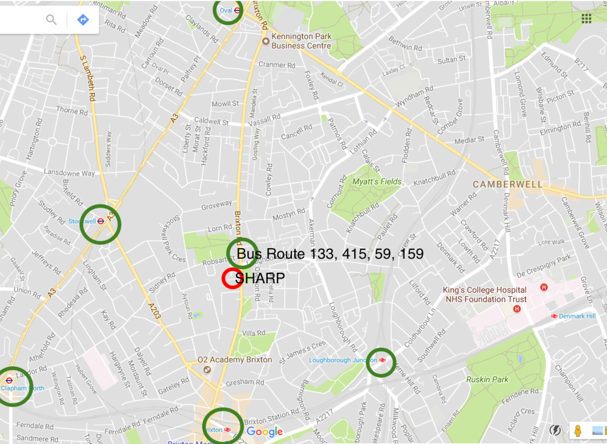
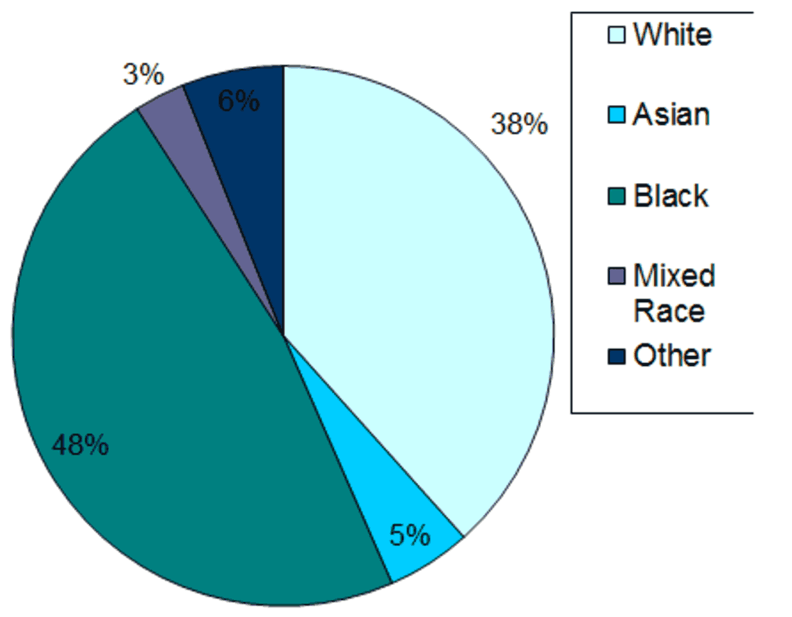

# Local setting

Initial feedback and results from the client questionnaires suggested that having the service 
based in central Lambeth was important for access and useability. Client interviews indicate 
that centrality and accessibility of the service are important factors in people’s ability to 
engage with therapies (SHARP Feasibility Study, 2006). 

> "The fact that I have no bad memories here is important. I like that when I come to SHARP 
> it is not about my medication and more about my hopes and the things I want to do with my life. 
> It's a happy place and a happy building which makes me want to go for my sessions."

> "Even on a bad day, it’s easy to get to you know? That helps get me out."

SHARP has shown its ability to engage and work with people who represent Lambeth and 
access its mental health services. 

Of those who are seen and assessed by SHARP over the last decade 70% have gone on to engage 
in therapy. A high proportion of those we have managed to engage and work with have come 
from Lambeth’s BME community.

