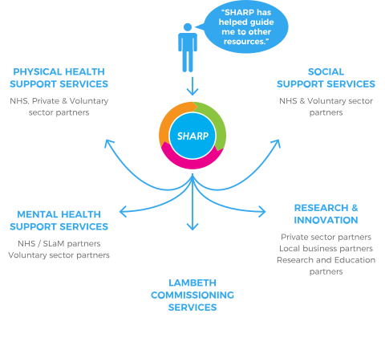

# Partnerships


One of the needs identified by staff and workers of Lambeth in the feasibility study was the need 
for SHARP to be able to provide connections within the community and help bridge the gap between 
services and unmet need. One of the ways in which SHARP has been successful in addressing this 
is through collaboration, co-production and the effective use of partnership work. 






### Linking adults with psychosis to secondary services in Lambeth 

SHARP provides connections within the community and helps bridge the gap between services and unmet 
need of those experiencing severe and enduring mental illness. One of the ways in which SHARP has been 
successful in addressing this need is through collaboration, co-production and the effective use of partnership work. 
We have successfully partnered with over 50 organisations including voluntary sector, businesses and learning institutions. 





 







### Collaboration with the Comedy School, Ritzy Cinema and Recovery College 

An example of this has been our recent partnership work and collaboration with the Comedy School, 
Ritzy cinema and recovery college to co-produce an annual event in honor of world mental health day. 
The series of improvisation workshops and events have had a major impact on people’s well-being.

<iframe src="https://player.vimeo.com/video/199067256" width="640" height="360" frameborder="0" webkitallowfullscreen mozallowfullscreen allowfullscreen></iframe>





> "Impro bought out a side of me that’s been hidden my entire life. In the course, and in impro generally 
> taking risk is positive, constructive and life affirming. I can honestly say that, for me, it’s 
> been a life changer and now I’m such an enthusiast!"
> - Person who has used SHARP services
	
> "when I feel anxious or in a low mood, I say to myself ‘okay, let’s go into impro mode’ 
> and I just impro my way through it! There’s nothing to fear, just go for it!"
> - Person who has used SHARP services




