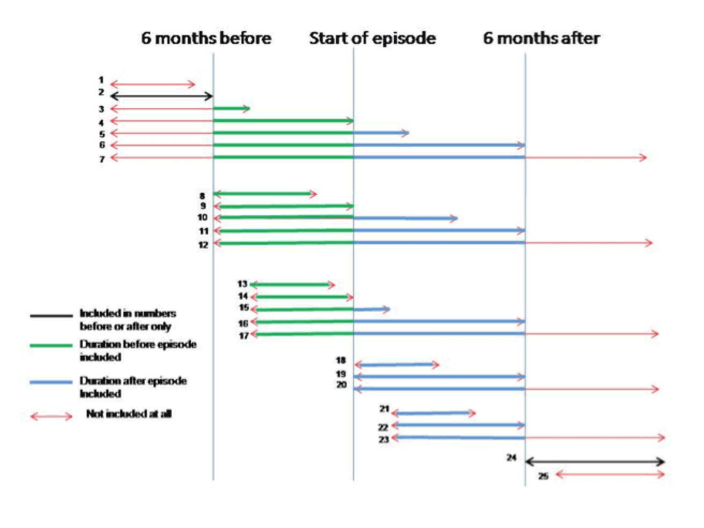

# Reduced cost to services


SHARP has shown a reduction in costs to the trust over the last decade. Engagement in SHARP 
interventions by those experiencing psychosis has lead to reduction in bed days. Evidence 
gathered demonstrates that SHARP has a positive impact on wellbeing of its users while creating 
cost savings for the trust over the last decade (McDonald & Josefsberg, unpublished).  




### Analysis of impact of SHARP treatment on subsequent hospital admissions using resampling



### Average number of bed days

	<a class="btn btn-data-toggler" data-chart="#chart-bed-days" data-set="data" href="#">6 months period</a> 
	<a class="btn btn-data-toggler" data-chart="#chart-bed-days" data-set="data_12" href="#">12 months period</a> 





### Average number of in patient episodes 

	<a class="btn btn-data-toggler" data-chart="#chart-episodes" data-set="data" href="#">6 months period</a> 
	<a class="btn btn-data-toggler" data-chart="#chart-episodes" data-set="data_12" href="#">12 months period</a> 







### Estimated cost saving over 10 years

| Number of bed days saved   (SHARP vs Comparison Group)				| 37,718			|
| Cost per bed day (acute ward)												| £421				|
| Saved in bed days over 10 years  (SHARP vs Comparison Group)			| £15,879,278		|
| Difference between cost of SHARP and Comparison Group (10 years)			| -£4,037,127		|
| **Total estimated saving for 10 years  (SHARP vs Comparison Group)**	| **£11,842,457**	|




 

£11.8M
Estimated saving over 10 years


Over the last decade SHARP has saved an estimated £11.8M when compared to costs and impact of services in the comparison group.





Source: McDonald & Josefsberg, unpublished



### Method



Episodes (ward and team in the Psychosis CAG) were included if he earliest started after 01/01/2000 (ePJS was fully 
established by then) and the latest was any starting before the data extraction date of 12/05/2017.  
For the calculation of duration all episodes still open on the data extraction date were considered closed on that day. 
No SHARP or team episode was included if it was less than 30 days long, as it was not considered that shorter 
episodes would have much impact on outcomes.

Patients were divided into the SHARP group -those with any SHARP episode recorded- and the comparison group- those with none. 
In the SHARP group the index episode was taken as the first one. Subsequent SHARP episodes were included in analysis as 
if they were any other later community episode.  To allow  “before-after” comparison, SHARP patients were included only 
if the index episode started at least 6 months after the start of the earliest episode of treatment (inpatient or community) 
in the Psychosis CAG and who also had at least 6 months after the start of their index episode during which the start of 
any subsequent admission or community episode had been recorded.  If no team episode or admission occurred within 6 months 
of the start of the index episode the patient was not included, as we did not know whether the patient had moved to another 
area rather than stopped needing Trust services.

Monte Carlo testing was carried out 1000 times. On each occasion patients for the comparison group were selected from those with no 
SHARP episodes by random selection with no replacement of index community episodes.  Like the index episode in SHARP 
patients, these were included if the index episode started at least 6 months after the start of the earliest episode 
of treatment (inpatient or community) in the Psychosis CAG and who also had at least 6 months after the start of their 
index episode during which the start of any subsequent admission or community episode would have been recorded. 
Episodes starting before SHARP began in 2006 were not sampled. Random selection was repeated until the number of 
patients in the comparison group with an index episode at least 6 months after the start of the earliest episode of treatment 
(inpatient or community) in the Psychosis CAG and who also had at least 6 months after discharge from/the start of their 
index episode during which the start of any subsequent admission or community episode would have been recorded. 
was equal to the same number of equivalent SHARP patients. Patients in the comparison group had only one index episode.





On each iteration, for both SHARP and patients from the comparison group, the number of community and inpatient episodes of care, 
including any active 6 months prior to the start of their index episode, was compared with the number of community and 
inpatient episodes of care starting within 6 months after the start of their index episode, including any active at this point. 
The number of days active with a community team and spent in an inpatient unit in the 6 months before and after the start 
of the index episode were counted and similarly compared.   Days active with more than one community team were added together. 
The Figure shows the permutations of the relationship between episode start and end and days included in or excluded from analysis.

 









