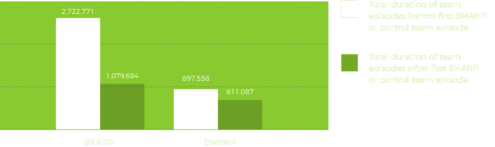

# Reduced cost to services


SHARP has shown a reduction in costs to the trust over the last decade. Engagement in 
SHARP interventions by those experiencing psychosis has lead to reduced service contact and bed usage.




### 61% reduction in team episodes after first SHARP episode

 

Source: Some study conducted by SLaM or Something Else (2014)



### Some financial statistics stuff

Lorem ipsum dolor sit amet, consectetur adipiscing elit. Proin quis mollis massa. Fusce dictum nunc felis, 
quis aliquam metus interdum semper. Quisque vitae gravida metus. Donec vel turpis urna. Etiam scelerisque 
nec enim sed pellentesque. Etiam fringilla ac enim eu ornare. Donec mauris leo, pretium quis ultrices in, 
venenatis sit amet nunc.





£2.5M
Estimated yearly saving to the trust






