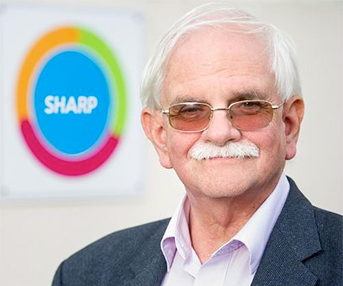

# Research and innovation


SHARP continues to be involved in research with King’s Health Partners and IOPPN. SHARP has 
facilitated pilot studies for ACT, AVATAR, Personalisation and My Health Locker and numerous 
other studies. We have been integral to the recruitment and facilitation process, enabling 
studies to run which may have been challenged due to site and participation barriers. We 
continue to be at the cutting edge of service delivery, incorporating new trialled and tested 
interventions into our core therapy offering such as mindfulness and ACT. 






### Articles

Josefsberg, S. & Bertram, M. (2011) [Social Inclusion: Putting Concept and Policy into Practice, 
Service and Service User Perspectives](https://journals.whitingbirch.net/index.php/SWSSR/article/view/504/540). 
_Social Work and Social Sciences Review_, 14 (3): 37-49.

Craig, T.K.J (2013). [Optimising outcomes for severe mental
illness: a service prescription](http://www.commonwealthhealth.org/wp-content/uploads/2013/07/Optimising-outcomes-for-severe-mental-illness_CHP13.pdf). 
_Commonwealth Health Partnerships_, 112-114.

Croucher, A (2016) [Courage and Wellbeing For a Life beyond Mental Illness](http://www.kingshealthpartners.org/latest/726-life-beyond-mental-illness). 
_Engage: the National Association for Gallery Education For Health Care Leaders Health Services Journal_, 28.

### Pilot site and centre for Research

Pilot site for recruitment and training delivery for [Consent For Contact](https://www.ncbi.nlm.nih.gov/pmc/articles/PMC4296527/) 
research into recruitment for mental health research. ‘Consent for Contact’ (C4C) enabled a framework 
to expedite recruitment and contribute to equitable access to research.

[My Health Locker](https://www.myhealthlockerlondon.nhs.uk/): Assisted in recruitment and user led development of project. 
Provided report on project evaluation of staff engagement and ways to increase buy in.

Josefsberg, s (2016). A qualitative project: 'Internal marketing and the effects on
staff buy-in': Exploring the attitudes of staff on the My Health
Locker Project. University Of Westminster, Unpublished.

Facilitation and recruitment of participants for  Walk this Way research pilot (2017)
Dr Julie Williams, Post-Doctoral Research Worker: CLAHRC South London

Pilot site for peer led writing workshops:
The Word Is Out, SHARP (2013). The word is out... out is the word. Self Published, UK.




 

> “SHARP has had a considerable impact on research in the Trust. It has helped with recruitment, 
> provided a base for clinical trials and SHARP staff have participated directly as research therapists 
> in a number of clinical trials. The latter (clinical team members delivering research based therapy) 
> is at particular risk should SHARP lose interest in research or the capacity to accommodate it.“
> - Tom K. J. Craig, Emeritus Professor Social Psychiatry





