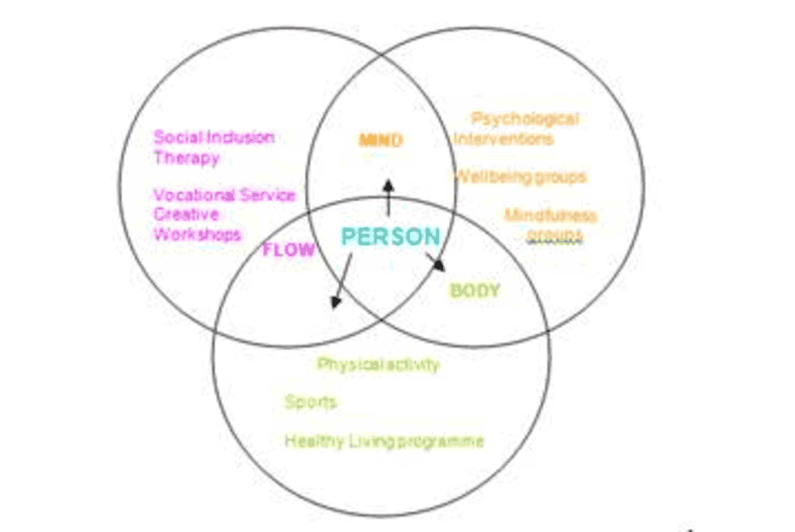

# Right support


The core business of SHARP is offering therapeutic and psychosocial interventions to enable people 
access to a broad range of activity options. 
Interventions are facilitated by a multidisciplinary team skilled in therapeutic delivery. 
A broad range of interventions and wellbeing initiatives are also offered in partnership with the community.






Benefits of SHARP service include its single point of entry for multiple interventions – one assessment 
to access all. This also benefits people in that all interventions all offered at one place- process 
of getting to know and feel comfortable with staff enabling confidence to explore other interventions i.e. 
CBT for psychosis, SIT.

	



> "Really impressed, they provided a wide range of things I could participate in."

> "The combination of having the three interventions provided by one team was invaluable 
> and marked the difference to what we had been offered in the past. The service we received 
> was totally personalised, supporting both our needs in a way that was totally respectful." 
> - carer




