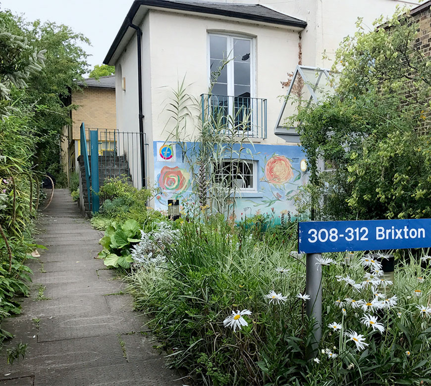

# Safe and friendly environment  



SHARP values a culture of respect, creativity and professionalism. From the first encounter with our 
service the focus is on the individual and their goals. We work to ensure that we challenge barriers 
in a safe way. We do this in order to help bring equality for those we work with. 







### Warm and welcoming

We know that environments are important in helping with people’s recovery (Daykin and O’Connor, 2008). 
SHARP’s building has been designed and renovated to promote positive mental health and wellbeing 
(Heidari et al, 2016). Our space ‘feels non-mental health’. The physical environment is colourful, 
warm and welcoming. From the natural light in rooms to the fish tank in our shared reception area, 
even the garden is maintained to enhance a sense of calm well- being. 

> "I think that the thing with SHARP is you know that when you come through the door you’re safe. 
> I feel it’s OK here, other places sometimes they are a bit more, you know, aggressive." 
> - Person who has used Sharp services 





 







### Lived experience is valued at SHARP

Staff represent the people we work with. Almost half (47%) of the people we employ at SHARP have lived 
experience of Mental Illness. From the staff who greet you at reception, to the SHARP gallery and physical 
health interventions, we provide jobs and grow skills so that people increase their confidence and employability. 

> "The fact that I have no bad memories here is important. I like that when I come to SHARP 
> it is not about my medication and more about my hopes and the things I want to do with my life. 
> It's a happy place and a happy building which makes me want to go for my sessions."
> - Person who has used Sharp services 





<iframe data-iframe-type="video" width="560" height="315" src="https://www.youtube.com/embed/Ta-lPC6C2fg?rel=0&amp;showinfo=0" frameborder="0" allowfullscreen></iframe>





